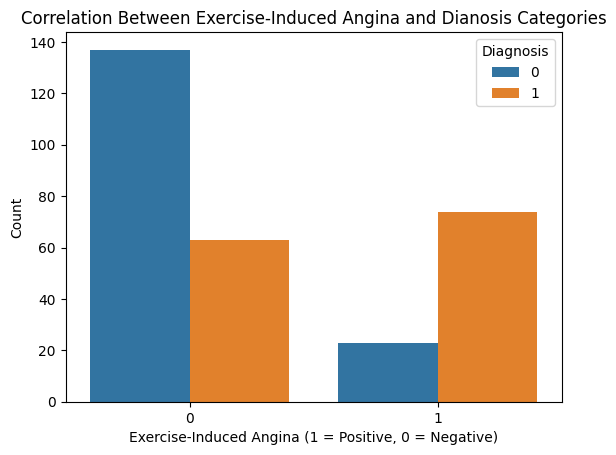

# Introduction

This Heart Disease dataset was collected and published by Andras Janosi et al. in 1989. This dataset was collected and used to predict the presence of Carotid Artery Stenosis in patients based on 13 attributes, out of 75. There are a total of four databases: Cleveland, Hungary, Switzerland, and the VA Long Beach. However, the Cleveland database is the only one that has been used by Machine Learning (ML) researchers, which will also be used for this study. This dataset contains a total of 303 observations together with 14 variables.

There are a total of 14 variables:

1. Age (Years) - age
2. Gender (1 = Male, 0 = Female) - gender
3. Types of Chest Pain (1 = Typical, 2 = Atypical Angina, 3 = Non-angina, 4 = Asymptomatic) - cp
4. Resting Blood Pressure (mmHg) - restbp
5. Serum Cholesterol (mg/dl) - chol
6. Fasting Blood Sugar >120 mg/dl (1 = True, 0 = False) - fbs
7. Resting Electrocardiographic Results (0 = Normal, 1 = Having ST-T Wave Abnormality, 2 = Probable Left Ventricular Hypertrophy) - restecg
8. Maximum Heart Rate (BPM) - maxhr
9. Exercise-Induced Angina (1 = True, 0 = False) (exang)
10. Exercise-Induced ST Depression Relative to Rest - exstdep
11. Slope of The Peak Exercise ST Segment (1 = Upsloping, 2 = Flat, 3 = Downsloping) - slope
12. Number of Major Vessels Colored by Fluoroscopy - cves
13. Thalassemia (3 = Normal, 6 = Fixed Defect, 7 = Reversable Defect) - thal
14. Diagnosis (1 = True, 0 = False) - diag

# Analysis

## Transformation

First, we import the necessary packages and dataset.


```python
import numpy as np
import pandas as pd
import matplotlib.pyplot as plt
from matplotlib.pyplot import subplots
import matplotlib.patches as mpatches
import seaborn as sns
```

The dataset are also slightly changed from the original:

- Changes to variable names.
- Changes to "diag" variable. For the purpose of this study, values greater than 1 in this variable are converted back to 1.
- Removal of NA values in "thal" and "cves". A total of 6 observations are removed (2% of the dataset)


```python
o_data = pd.read_csv("cleveland-data.csv", header = None)
data = o_data.copy()
# Change variable names
data.columns = ["age", "gender", "cp", "restbp", "chol", "fbs", "restecg", "maxhr",
                "exang", "exstdep", "stslope", "cves", "thal", "diag"]
# diag variable has values greater than 1
data["diag"] = np.where(data["diag"] >= 1, 1, 0)
# Remove observations with NA values, a total of 6 observations (2% of dataset) 
data = data[(data["thal"] != "?")]
data = data[(data["cves"] != "?")]
# Change data type to float, so we can calculate the correlation
data = data.astype("float64")
```

We check for variables with significant correlation to "diag" (with a score of 0.05 or higher). Any variables lower than 0.05 are removed. In this case, "fbs" is removed.


```python
abs(data.corr()["diag"]) >= 0.05 # Find variables that correlate with diag (a score of 0.05 or higher)
```


    age         True
    gender      True
    cp          True
    restbp      True
    chol        True
    fbs        False
    restecg     True
    maxhr       True
    exang       True
    exstdep     True
    stslope     True
    cves        True
    thal        True
    diag        True
    Name: diag, dtype: bool


```python
data = data.drop("fbs", axis = 1) # Remove fbs(lower than 0.05 correlation score)
```

Now we check the correlation between all variables in the dataset, as well as their statistics.


```python
data.corr() # Check correlation between other variables
```


<div>
<style scoped>
    .dataframe tbody tr th:only-of-type {
        vertical-align: middle;
    }

    .dataframe tbody tr th {
        vertical-align: top;
    }

    .dataframe thead th {
        text-align: right;
    }
</style>
<table border="1" class="dataframe">
  <thead>
    <tr style="text-align: right;">
      <th></th>
      <th>age</th>
      <th>gender</th>
      <th>cp</th>
      <th>restbp</th>
      <th>chol</th>
      <th>restecg</th>
      <th>maxhr</th>
      <th>exang</th>
      <th>exstdep</th>
      <th>stslope</th>
      <th>cves</th>
      <th>thal</th>
      <th>diag</th>
    </tr>
  </thead>
  <tbody>
    <tr>
      <th>age</th>
      <td>1.000000</td>
      <td>-0.092399</td>
      <td>0.110471</td>
      <td>0.290476</td>
      <td>0.202644</td>
      <td>0.149917</td>
      <td>-0.394563</td>
      <td>0.096489</td>
      <td>0.197123</td>
      <td>0.159405</td>
      <td>0.362210</td>
      <td>0.126586</td>
      <td>0.227075</td>
    </tr>
    <tr>
      <th>gender</th>
      <td>-0.092399</td>
      <td>1.000000</td>
      <td>0.008908</td>
      <td>-0.066340</td>
      <td>-0.198089</td>
      <td>0.033897</td>
      <td>-0.060496</td>
      <td>0.143581</td>
      <td>0.106567</td>
      <td>0.033345</td>
      <td>0.091925</td>
      <td>0.383652</td>
      <td>0.278467</td>
    </tr>
    <tr>
      <th>cp</th>
      <td>0.110471</td>
      <td>0.008908</td>
      <td>1.000000</td>
      <td>-0.036980</td>
      <td>0.072088</td>
      <td>0.063905</td>
      <td>-0.339308</td>
      <td>0.377525</td>
      <td>0.203244</td>
      <td>0.151079</td>
      <td>0.235644</td>
      <td>0.268500</td>
      <td>0.408945</td>
    </tr>
    <tr>
      <th>restbp</th>
      <td>0.290476</td>
      <td>-0.066340</td>
      <td>-0.036980</td>
      <td>1.000000</td>
      <td>0.131536</td>
      <td>0.149242</td>
      <td>-0.049108</td>
      <td>0.066691</td>
      <td>0.191243</td>
      <td>0.121172</td>
      <td>0.097954</td>
      <td>0.138183</td>
      <td>0.153490</td>
    </tr>
    <tr>
      <th>chol</th>
      <td>0.202644</td>
      <td>-0.198089</td>
      <td>0.072088</td>
      <td>0.131536</td>
      <td>1.000000</td>
      <td>0.165046</td>
      <td>-0.000075</td>
      <td>0.059339</td>
      <td>0.038596</td>
      <td>-0.009215</td>
      <td>0.115945</td>
      <td>0.010859</td>
      <td>0.080285</td>
    </tr>
    <tr>
      <th>restecg</th>
      <td>0.149917</td>
      <td>0.033897</td>
      <td>0.063905</td>
      <td>0.149242</td>
      <td>0.165046</td>
      <td>1.000000</td>
      <td>-0.072290</td>
      <td>0.081874</td>
      <td>0.113726</td>
      <td>0.135141</td>
      <td>0.129021</td>
      <td>0.018795</td>
      <td>0.166343</td>
    </tr>
    <tr>
      <th>maxhr</th>
      <td>-0.394563</td>
      <td>-0.060496</td>
      <td>-0.339308</td>
      <td>-0.049108</td>
      <td>-0.000075</td>
      <td>-0.072290</td>
      <td>1.000000</td>
      <td>-0.384368</td>
      <td>-0.347640</td>
      <td>-0.389307</td>
      <td>-0.268727</td>
      <td>-0.274831</td>
      <td>-0.423817</td>
    </tr>
    <tr>
      <th>exang</th>
      <td>0.096489</td>
      <td>0.143581</td>
      <td>0.377525</td>
      <td>0.066691</td>
      <td>0.059339</td>
      <td>0.081874</td>
      <td>-0.384368</td>
      <td>1.000000</td>
      <td>0.289310</td>
      <td>0.250572</td>
      <td>0.148232</td>
      <td>0.326927</td>
      <td>0.421355</td>
    </tr>
    <tr>
      <th>exstdep</th>
      <td>0.197123</td>
      <td>0.106567</td>
      <td>0.203244</td>
      <td>0.191243</td>
      <td>0.038596</td>
      <td>0.113726</td>
      <td>-0.347640</td>
      <td>0.289310</td>
      <td>1.000000</td>
      <td>0.579037</td>
      <td>0.294452</td>
      <td>0.344976</td>
      <td>0.424052</td>
    </tr>
    <tr>
      <th>stslope</th>
      <td>0.159405</td>
      <td>0.033345</td>
      <td>0.151079</td>
      <td>0.121172</td>
      <td>-0.009215</td>
      <td>0.135141</td>
      <td>-0.389307</td>
      <td>0.250572</td>
      <td>0.579037</td>
      <td>1.000000</td>
      <td>0.109761</td>
      <td>0.279688</td>
      <td>0.333049</td>
    </tr>
    <tr>
      <th>cves</th>
      <td>0.362210</td>
      <td>0.091925</td>
      <td>0.235644</td>
      <td>0.097954</td>
      <td>0.115945</td>
      <td>0.129021</td>
      <td>-0.268727</td>
      <td>0.148232</td>
      <td>0.294452</td>
      <td>0.109761</td>
      <td>1.000000</td>
      <td>0.256382</td>
      <td>0.463189</td>
    </tr>
    <tr>
      <th>thal</th>
      <td>0.126586</td>
      <td>0.383652</td>
      <td>0.268500</td>
      <td>0.138183</td>
      <td>0.010859</td>
      <td>0.018795</td>
      <td>-0.274831</td>
      <td>0.326927</td>
      <td>0.344976</td>
      <td>0.279688</td>
      <td>0.256382</td>
      <td>1.000000</td>
      <td>0.526640</td>
    </tr>
    <tr>
      <th>diag</th>
      <td>0.227075</td>
      <td>0.278467</td>
      <td>0.408945</td>
      <td>0.153490</td>
      <td>0.080285</td>
      <td>0.166343</td>
      <td>-0.423817</td>
      <td>0.421355</td>
      <td>0.424052</td>
      <td>0.333049</td>
      <td>0.463189</td>
      <td>0.526640</td>
      <td>1.000000</td>
    </tr>
  </tbody>
</table>
</div>


```python
round(data.describe(),2) # Check the statistics of the variables
```


<div>
<style scoped>
    .dataframe tbody tr th:only-of-type {
        vertical-align: middle;
    }

    .dataframe tbody tr th {
        vertical-align: top;
    }

    .dataframe thead th {
        text-align: right;
    }
</style>
<table border="1" class="dataframe">
  <thead>
    <tr style="text-align: right;">
      <th></th>
      <th>age</th>
      <th>gender</th>
      <th>cp</th>
      <th>restbp</th>
      <th>chol</th>
      <th>restecg</th>
      <th>maxhr</th>
      <th>exang</th>
      <th>exstdep</th>
      <th>stslope</th>
      <th>cves</th>
      <th>thal</th>
      <th>diag</th>
    </tr>
  </thead>
  <tbody>
    <tr>
      <th>count</th>
      <td>297.00</td>
      <td>297.00</td>
      <td>297.00</td>
      <td>297.00</td>
      <td>297.00</td>
      <td>297.00</td>
      <td>297.00</td>
      <td>297.00</td>
      <td>297.00</td>
      <td>297.00</td>
      <td>297.00</td>
      <td>297.00</td>
      <td>297.00</td>
    </tr>
    <tr>
      <th>mean</th>
      <td>54.54</td>
      <td>0.68</td>
      <td>3.16</td>
      <td>131.69</td>
      <td>247.35</td>
      <td>1.00</td>
      <td>149.60</td>
      <td>0.33</td>
      <td>1.06</td>
      <td>1.60</td>
      <td>0.68</td>
      <td>4.73</td>
      <td>0.46</td>
    </tr>
    <tr>
      <th>std</th>
      <td>9.05</td>
      <td>0.47</td>
      <td>0.96</td>
      <td>17.76</td>
      <td>52.00</td>
      <td>0.99</td>
      <td>22.94</td>
      <td>0.47</td>
      <td>1.17</td>
      <td>0.62</td>
      <td>0.94</td>
      <td>1.94</td>
      <td>0.50</td>
    </tr>
    <tr>
      <th>min</th>
      <td>29.00</td>
      <td>0.00</td>
      <td>1.00</td>
      <td>94.00</td>
      <td>126.00</td>
      <td>0.00</td>
      <td>71.00</td>
      <td>0.00</td>
      <td>0.00</td>
      <td>1.00</td>
      <td>0.00</td>
      <td>3.00</td>
      <td>0.00</td>
    </tr>
    <tr>
      <th>25%</th>
      <td>48.00</td>
      <td>0.00</td>
      <td>3.00</td>
      <td>120.00</td>
      <td>211.00</td>
      <td>0.00</td>
      <td>133.00</td>
      <td>0.00</td>
      <td>0.00</td>
      <td>1.00</td>
      <td>0.00</td>
      <td>3.00</td>
      <td>0.00</td>
    </tr>
    <tr>
      <th>50%</th>
      <td>56.00</td>
      <td>1.00</td>
      <td>3.00</td>
      <td>130.00</td>
      <td>243.00</td>
      <td>1.00</td>
      <td>153.00</td>
      <td>0.00</td>
      <td>0.80</td>
      <td>2.00</td>
      <td>0.00</td>
      <td>3.00</td>
      <td>0.00</td>
    </tr>
    <tr>
      <th>75%</th>
      <td>61.00</td>
      <td>1.00</td>
      <td>4.00</td>
      <td>140.00</td>
      <td>276.00</td>
      <td>2.00</td>
      <td>166.00</td>
      <td>1.00</td>
      <td>1.60</td>
      <td>2.00</td>
      <td>1.00</td>
      <td>7.00</td>
      <td>1.00</td>
    </tr>
    <tr>
      <th>max</th>
      <td>77.00</td>
      <td>1.00</td>
      <td>4.00</td>
      <td>200.00</td>
      <td>564.00</td>
      <td>2.00</td>
      <td>202.00</td>
      <td>1.00</td>
      <td>6.20</td>
      <td>3.00</td>
      <td>3.00</td>
      <td>7.00</td>
      <td>1.00</td>
    </tr>
  </tbody>
</table>
</div>


We change the datatype of the variables with binary values to categorical to work with them later.


```python
# Change the data type so they can be worked with later
data = data.astype({
    "age" : "float64",
    "gender" : "int64",
    "cp" : "int64",
    "restbp" : "float64",
    "chol" : "float64",
    "restecg" : "int64",
    "maxhr" : "float64",
    "exang" : "int64",
    "exstdep" : "float64",
    "stslope" : "int64",
    "cves" : "int64",
    "thal" : "int64",
    "diag" : "int64"
})
data = data.astype({
    "age" : "float64",
    "gender" : "str",
    "cp" : "str",
    "restbp" : "float64",
    "chol" : "float64",
    "restecg" : "str",
    "maxhr" : "float64",
    "exang" : "str",
    "exstdep" : "float64",
    "stslope" : "str",
    "cves" : "str",
    "thal" : "str",
    "diag" : "str"
})
data = data.astype({
    "age" : "float64",
    "gender" : "category",
    "cp" : "category",
    "restbp" : "float64",
    "chol" : "float64",
    "restecg" : "category",
    "maxhr" : "float64",
    "exang" : "category",
    "exstdep" : "float64",
    "stslope" : "category",
    "cves" : "category",
    "thal" : "category",
    "diag" : "category"
})
data.dtypes
```


    age         float64
    gender     category
    cp         category
    restbp      float64
    chol        float64
    restecg    category
    maxhr       float64
    exang      category
    exstdep     float64
    stslope    category
    cves       category
    thal       category
    diag       category
    dtype: object


## EDA

First we will confirm the distribution of patients based on their age. It seems that patients have a higher chance of having the heart disease between the age of 55 and 63.


```python
sns.histplot(data = data, x = "age", hue = "diag")
plt.title("Distribution of Patients Based on Their Age")
plt.xlabel("Age Group")
plt.legend(title = "Diagnosis", labels = ["1", "0"]);
```


    

    


Next, we will check the distribution of patients based on their gender. Interestingly, female patients have a lower chance of having heart disease than male.


```python
sns.countplot(data = data, x = "gender", hue = "diag")
plt.title("Distribution of Patients Based on Their Gender")
plt.xlabel("Gender (0= Female, 1 = Male)")
plt.ylabel("Count")
plt.legend(title = "Diagnosis");
```


    

    


We check the correlation between chest pain and diagnosis categories. It seems that when patients have chest pain type 4 (asymptomatic), there is a singificant chance that they also have the heart disease.


```python
sns.countplot(data = data, x = "cp", hue = "diag")
plt.title("Correlation Between Chest Pain and Diagnosis Categories")
plt.xlabel("Chest Pain \n (1 = Typical, 2 = Atypical Angina, \n 3 = Non-Angina Pain, 4 = Asymptomatic)")
plt.ylabel("Count")
plt.legend(title = "Diagnosis");
```


    

    


```python
sns.countplot(data = data, x = "diag", hue = "cp")
plt.title("Correlation Between Diagnosis and Chest Pain Categories")
plt.xlabel("Diagnosis")
plt.ylabel("Count")
plt.legend(title = "Chest Pain");
```


    

    


Here, we can see that when patients have type 4 chest pain, there is a 70% chance of having the disease.


```python
total = data.groupby(["cp"]).agg({"age":"count"}).reset_index()
pos = data[data["diag"] == "1"].groupby(["cp"]).agg({"age":"count"}).reset_index()
total["perc"] = [i / j for i, j in zip(total["age"], total["age"])]
pos["perc"] = [i / j for i, j in zip(pos["age"], total["age"])]

bar1 = sns.barplot(data = total, x = "cp", y = "perc", color = "darkblue")
bar2 = sns.barplot(data = pos, x = "cp", y = "perc", color = "lightblue")

top_bar = mpatches.Patch(color = "darkblue", label = "0")
bot_bar = mpatches.Patch(color = "lightblue", label = "1")
plt.legend(handles = [top_bar, bot_bar], title = "Diagnosis", loc = "upper left")
plt.title("Percentage of Patients With Heart Disease Based on Chest Pain Categories")
plt.xlabel("Chest Pain")
plt.ylabel("Percentage");
```


    

    


Next, we want to see the average max heart rate of patients who were diagnosed with the heart disease. They (160) seem to have lower max heart rate than those who were not (140).


```python
sns.boxplot(data = data, x = "diag", y = "maxhr")
plt.title("Average Max Heart Rate of Patients With Heart Disease")
plt.xlabel("Diagnosis")
plt.ylabel("Max Heart Rate (Beats Per Minute)");
```


    

    


Patients who experience chest pain while excercising also have a higher chance of being diagnosed.


```python
sns.countplot(data = data, x = "exang", hue = "diag")
plt.title("Correlation Between Exercise-Induced Angina and Dianosis Categories")
plt.xlabel("Exercise-Induced Angina (1 = Positive, 0 = Negative)")
plt.ylabel("Count")
plt.legend(title = "Diagnosis");
```


    

    


Patients with heart disease also tend to have higher values of excercise-induced ST depression. Note that these values are relative to their rest state.


```python
sns.boxplot(data = data, x = "diag", y = "exstdep")
plt.title("Average Exercise-Induced ST Depression (Relative To Rest) and Diagnosis Categories")
plt.xlabel("Diagnosis")
plt.ylabel("Exercise-Induced ST Depression (Relative To Rest)");
```


    

    


This is the ST slope of patients, categorized by the values of "diag". It seems that upsloping patients are not susceptible, unlike those with a flat slope. Unfortunately, there are too few patients with a down slope to draw meaningful conclusion.


```python
sns.countplot(data = data, x = "stslope", hue = "diag")
plt.title("Correlation Between ST Slope and Diagnosis Categories")
plt.xlabel("ST Slope (1 = Up, 2 = Flat, 3 = Down)")
plt.ylabel("Count")
plt.legend(title = "Diagnosis");
```


    

    


Here, patients with more colored major vessels tend to have higher chance of getting the heart disease, which is in line with our study.


```python
# Create two dataset containing all patients and only those with a heart disease
total = data.groupby(["cves"]).agg({"age":"count"}).reset_index()
pos = data[data["diag"] == "1"].groupby("cves").agg({"age":"count"}).reset_index()

# Create bar chart that shows the percentage of patients for each value in cves variable
total["perc"] = [i / j for i, j in zip(total["age"], total["age"])]
pos["perc"] = [i / j for i, j in zip(pos["age"], total["age"])]
bar1 = sns.barplot(data = total, x = "cves", y = "perc", color = "darkblue")
bar2 = sns.barplot(data = pos, x = "cves", y = "perc", color = "lightblue")

top_bar = mpatches.Patch(color = "darkblue", label = "0")
bot_bar = mpatches.Patch(color = "lightblue", label = "1")
plt.legend(title = "Diagnosis", handles = [top_bar, bot_bar])
plt.xlabel("Number of Colored Major Vessels")
plt.ylabel("Percentage")
plt.title("Percentage of Patients With Heart Disease")
;
```


    ''


    

    


Lastly, it seems like patients without thalassemia have a lower chance of getting the heart disease.


```python
sns.countplot(data = data, x = "thal", hue = "diag")
plt.title("Correlation between Thalassemia and Diagnosis Categories")
plt.legend(title = "Diagnosis")
plt.ylabel("Count")
plt.xlabel("Thalassemia Type (3 = Normal, 6 = Fixed Defect, 7 = Reversable Defect)");
```


    

    


## Chest Pain Analysis

From the EDA above, we have learned that "cp", "exang", "cves" and "thal" variables are all correlated with the diagnosis, especially "cp" where 70% of patients with type 4 (asymptomatic) were diagnosed with a defective heart.

Now, we will check whether "cp" are affected by other factors.

First, we check the max heart rate for each type of chest pain. It seems like type 4 chest pain has lower heart rate than other types.


```python
sns.boxplot(data = data, x = "cp", y = "maxhr")
plt.title("Average Max Heart Rate For Each Type of Chest Pain")
plt.ylabel("Max Heart Rate")
plt.xlabel("Chest Pain");
```


    

    


From the plot below, there is a pattern where patients with type 4 (and type 3) chest pain have a higher chance of having the heart disease when their exercise-induced ST depression are higher than those without.


```python
sns.boxplot(data = data, x = "cp", y = "exstdep", hue = 'diag')
plt.title("Average Exercise/Rest ST Depression For Each Type of Chest Pain")
plt.xlabel("Chest Pain")
plt.ylabel("Exercise-Induced ST Depression Relative to Rest")
plt.legend(title = "Diagnosis");
```


    

    


It seems like the chest pain caused by exercise-induced angina belongs to type 4.


```python
sns.countplot(data = data, x = "cp", hue = "exang")
plt.title("Distribution of Exercise-Induced Angina For Each Type of Chest Pain")
plt.xlabel("Chest Pain")
plt.ylabel("Count")
plt.legend(title = "Angina");
```


    

    


Below is the distribution of the ST slope for each value of "cp" variable.


```python
sns.countplot(data = data, x = "cp", hue = "stslope")
plt.title("Distribution of Different Types of ST Slope")
plt.xlabel("Chest Pain")
plt.ylabel("Count")
plt.legend(title = "ST Slope");
```


    

    


Patients with type 4 chest pain also seem to have higher average number of colored vessels.


```python
cves_data = data.astype({"cves":"int"})
sns.boxplot(data= cves_data, x = "cp", y = "cves")
plt.title("Average Number of Colored Major Vessels for Each Type of Chest Pain")
plt.xlabel("Chest Pain")
plt.ylabel("Colored Vessels")
;
```


    ''


    

    


```python
sns.countplot(data = data, x = "cp", hue = "cves")
plt.title("Number of Colored Major Vessels For Each Type of Chest Pain")
plt.xlabel("Chest Pain")
plt.ylabel("Count")
plt.legend(title = "Colored Vessels");
```


    

    


```python
fig, axes = subplots(ncols = 2, figsize = (8,8), sharey="all")
sns.countplot(data = data[data["cp"] == "4"], x = "cves", ax = axes[0])
sns.countplot(data = data[data["cp"] == "4"], x = "cves", hue = "diag", ax = axes[1]) # may not be very useful because this is cp = 4

axes[0].set_title("Colored Vessels for Type 4 Chest Pain")
axes[0].set_ylabel("Count")
axes[0].set_xlabel("Colored Vessels")

axes[1].set_title("Based on Diagnosis")
axes[1].set_ylabel("Count")
axes[1].set_xlabel("Colored Vessels")
axes[1].legend(title = "Diagnosis");
```


    

    


## Machine Learning

For this study, we will predict the presence of the heart disease by using two classification models: K Nearest Neighbors (KNN) and Logistics. We will see which model will give the better results for this dataset.

First, we will import the functions from sklearn package.


```python
from sklearn.model_selection import train_test_split # To create training and test set
from sklearn.preprocessing import StandardScaler # To scale the data for KNN
from sklearn.neighbors import KNeighborsClassifier
from sklearn.metrics import accuracy_score, classification_report, ConfusionMatrixDisplay # To analyze the results
from sklearn.model_selection import GridSearchCV
from sklearn.model_selection import KFold, cross_val_score, StratifiedKFold # To test the models through cross validation
from sklearn.linear_model import LogisticRegression
```

We transform the dataset so that we can use them for machine learning. There are variables within the dataset that do not have the right format that machine learning models can use. For example, "thal" variable have three values: 3, 6 and 7. So we transform them back to binary variables with only 1 and 0 values. At the same time, we separate the dependent (y) and independent (x) variables.


```python
data.head()
```


<div>
<style scoped>
    .dataframe tbody tr th:only-of-type {
        vertical-align: middle;
    }

    .dataframe tbody tr th {
        vertical-align: top;
    }

    .dataframe thead th {
        text-align: right;
    }
</style>
<table border="1" class="dataframe">
  <thead>
    <tr style="text-align: right;">
      <th></th>
      <th>age</th>
      <th>gender</th>
      <th>cp</th>
      <th>restbp</th>
      <th>chol</th>
      <th>restecg</th>
      <th>maxhr</th>
      <th>exang</th>
      <th>exstdep</th>
      <th>stslope</th>
      <th>cves</th>
      <th>thal</th>
      <th>diag</th>
    </tr>
  </thead>
  <tbody>
    <tr>
      <th>0</th>
      <td>63.0</td>
      <td>1</td>
      <td>1</td>
      <td>145.0</td>
      <td>233.0</td>
      <td>2</td>
      <td>150.0</td>
      <td>0</td>
      <td>2.3</td>
      <td>3</td>
      <td>0</td>
      <td>6</td>
      <td>0</td>
    </tr>
    <tr>
      <th>1</th>
      <td>67.0</td>
      <td>1</td>
      <td>4</td>
      <td>160.0</td>
      <td>286.0</td>
      <td>2</td>
      <td>108.0</td>
      <td>1</td>
      <td>1.5</td>
      <td>2</td>
      <td>3</td>
      <td>3</td>
      <td>1</td>
    </tr>
    <tr>
      <th>2</th>
      <td>67.0</td>
      <td>1</td>
      <td>4</td>
      <td>120.0</td>
      <td>229.0</td>
      <td>2</td>
      <td>129.0</td>
      <td>1</td>
      <td>2.6</td>
      <td>2</td>
      <td>2</td>
      <td>7</td>
      <td>1</td>
    </tr>
    <tr>
      <th>3</th>
      <td>37.0</td>
      <td>1</td>
      <td>3</td>
      <td>130.0</td>
      <td>250.0</td>
      <td>0</td>
      <td>187.0</td>
      <td>0</td>
      <td>3.5</td>
      <td>3</td>
      <td>0</td>
      <td>3</td>
      <td>0</td>
    </tr>
    <tr>
      <th>4</th>
      <td>41.0</td>
      <td>0</td>
      <td>2</td>
      <td>130.0</td>
      <td>204.0</td>
      <td>2</td>
      <td>172.0</td>
      <td>0</td>
      <td>1.4</td>
      <td>1</td>
      <td>0</td>
      <td>3</td>
      <td>0</td>
    </tr>
  </tbody>
</table>
</div>


```python
data_dummies = data.select_dtypes("category")
data_numeric = data.select_dtypes(exclude="category")
ml_data = pd.concat([data_numeric, pd.get_dummies(data_dummies,drop_first= True, dtype = "int")], axis = 1)
y_o = ml_data["diag_1"]
x_o = ml_data.drop("diag_1", axis = 1)
```

From the original dataset, we create a test set (which contains 20% of the dataset), and a training set (with contains the remaining 80%).


```python
x_train, x_test, y_train, y_test = train_test_split(x_o, y_o, test_size = 0.2, random_state=39) # 20% of the ml_data is test set
```

### KNN

We scale our x variables to work better with KNN model.


```python
scaler = StandardScaler() # Scaled the data to work with KNN
x_scaled_train = scaler.fit_transform(x_train)
x_scaled_test = scaler.transform(x_test)
```

Here, we will try to predict the classification by using K = 10 neighbors. For this training set, we achieve an accuracy of 80%. Note that while the precision (true positive out of all predicted positive classification) is high, the recall (true positive out of all real positive classification in the dataset) score is low for positive classification (96% vs 67%).


```python
knn_model = KNeighborsClassifier(n_neighbors=10)
knn_model.fit(X = x_scaled_train, y = y_train)
y_pred = knn_model.predict(X = x_scaled_test)
print(classification_report(y_true = y_test, y_pred = y_pred))
```

                  precision    recall  f1-score   support
    
               0       0.70      0.96      0.81        27
               1       0.96      0.67      0.79        33
    
        accuracy                           0.80        60
       macro avg       0.83      0.81      0.80        60
    weighted avg       0.84      0.80      0.80        60
    
    


```python
ConfusionMatrixDisplay.from_predictions(y_test, y_pred)
```


    <sklearn.metrics._plot.confusion_matrix.ConfusionMatrixDisplay at 0x1e893e73d90>


    

    


Due to the low recall score, we will test the model by using multiple values of the K neighbors (1, 5, 10, 20, 30, 50 and 100). As a result, K = 30 is the most accurate.


```python
k_neighbors = [1,5,10,20,30,50,100]
k_acc = []
for k in k_neighbors:
    knn_model = KNeighborsClassifier(n_neighbors=k)
    knn_model.fit(x_scaled_train, y_train)
    y_pred = knn_model.predict(x_scaled_test)
    k_acc.append(accuracy_score(y_true = y_test, y_pred = y_pred))
sns.lineplot(x = k_neighbors, y = k_acc);
```


    

    


However, the result above is only for the current training and test set. To confirm our result, we will use Grid Search function of sklearn, validated by using cross validation. It turns out that the real best K values is 50, instead of 30.


```python
k_neighbors = [1,5,10,20,30,50,100]
x_scaled_o = scaler.fit_transform(x_o)
knn_model = KNeighborsClassifier()
param_grid = {"n_neighbors":k_neighbors}
grid_model = GridSearchCV(knn_model, param_grid= param_grid, cv=10, scoring="accuracy")
grid_model.fit(x_scaled_o, y_o)
grid_model.best_params_
```


    {'n_neighbors': 50}


Note that the accuracy between K = 30 and K = 50 is not much different.


```python
pd.DataFrame(grid_model.cv_results_)
```


<div>
<style scoped>
    .dataframe tbody tr th:only-of-type {
        vertical-align: middle;
    }

    .dataframe tbody tr th {
        vertical-align: top;
    }

    .dataframe thead th {
        text-align: right;
    }
</style>
<table border="1" class="dataframe">
  <thead>
    <tr style="text-align: right;">
      <th></th>
      <th>mean_fit_time</th>
      <th>std_fit_time</th>
      <th>mean_score_time</th>
      <th>std_score_time</th>
      <th>param_n_neighbors</th>
      <th>params</th>
      <th>split0_test_score</th>
      <th>split1_test_score</th>
      <th>split2_test_score</th>
      <th>split3_test_score</th>
      <th>split4_test_score</th>
      <th>split5_test_score</th>
      <th>split6_test_score</th>
      <th>split7_test_score</th>
      <th>split8_test_score</th>
      <th>split9_test_score</th>
      <th>mean_test_score</th>
      <th>std_test_score</th>
      <th>rank_test_score</th>
    </tr>
  </thead>
  <tbody>
    <tr>
      <th>0</th>
      <td>0.000836</td>
      <td>0.000626</td>
      <td>0.003298</td>
      <td>0.000950</td>
      <td>1</td>
      <td>{'n_neighbors': 1}</td>
      <td>0.866667</td>
      <td>0.800000</td>
      <td>0.766667</td>
      <td>0.833333</td>
      <td>0.833333</td>
      <td>0.700000</td>
      <td>0.666667</td>
      <td>0.896552</td>
      <td>0.758621</td>
      <td>0.793103</td>
      <td>0.791494</td>
      <td>0.067760</td>
      <td>7</td>
    </tr>
    <tr>
      <th>1</th>
      <td>0.000630</td>
      <td>0.000560</td>
      <td>0.002883</td>
      <td>0.000494</td>
      <td>5</td>
      <td>{'n_neighbors': 5}</td>
      <td>0.800000</td>
      <td>0.766667</td>
      <td>0.833333</td>
      <td>0.866667</td>
      <td>0.866667</td>
      <td>0.833333</td>
      <td>0.800000</td>
      <td>0.931034</td>
      <td>0.758621</td>
      <td>0.793103</td>
      <td>0.824943</td>
      <td>0.049931</td>
      <td>2</td>
    </tr>
    <tr>
      <th>2</th>
      <td>0.000568</td>
      <td>0.000584</td>
      <td>0.003128</td>
      <td>0.000643</td>
      <td>10</td>
      <td>{'n_neighbors': 10}</td>
      <td>0.833333</td>
      <td>0.766667</td>
      <td>0.800000</td>
      <td>0.900000</td>
      <td>0.900000</td>
      <td>0.833333</td>
      <td>0.800000</td>
      <td>0.862069</td>
      <td>0.724138</td>
      <td>0.827586</td>
      <td>0.824713</td>
      <td>0.052531</td>
      <td>3</td>
    </tr>
    <tr>
      <th>3</th>
      <td>0.001121</td>
      <td>0.000864</td>
      <td>0.003534</td>
      <td>0.001148</td>
      <td>20</td>
      <td>{'n_neighbors': 20}</td>
      <td>0.833333</td>
      <td>0.766667</td>
      <td>0.766667</td>
      <td>0.866667</td>
      <td>0.900000</td>
      <td>0.800000</td>
      <td>0.800000</td>
      <td>0.758621</td>
      <td>0.724138</td>
      <td>0.793103</td>
      <td>0.800920</td>
      <td>0.050283</td>
      <td>5</td>
    </tr>
    <tr>
      <th>4</th>
      <td>0.000899</td>
      <td>0.000482</td>
      <td>0.004621</td>
      <td>0.000842</td>
      <td>30</td>
      <td>{'n_neighbors': 30}</td>
      <td>0.866667</td>
      <td>0.800000</td>
      <td>0.800000</td>
      <td>0.900000</td>
      <td>0.933333</td>
      <td>0.800000</td>
      <td>0.800000</td>
      <td>0.827586</td>
      <td>0.724138</td>
      <td>0.793103</td>
      <td>0.824483</td>
      <td>0.057264</td>
      <td>4</td>
    </tr>
    <tr>
      <th>5</th>
      <td>0.001282</td>
      <td>0.000791</td>
      <td>0.004540</td>
      <td>0.000897</td>
      <td>50</td>
      <td>{'n_neighbors': 50}</td>
      <td>0.833333</td>
      <td>0.766667</td>
      <td>0.833333</td>
      <td>0.900000</td>
      <td>0.900000</td>
      <td>0.733333</td>
      <td>0.833333</td>
      <td>0.931034</td>
      <td>0.724138</td>
      <td>0.827586</td>
      <td>0.828276</td>
      <td>0.066768</td>
      <td>1</td>
    </tr>
    <tr>
      <th>6</th>
      <td>0.001173</td>
      <td>0.000692</td>
      <td>0.004541</td>
      <td>0.001475</td>
      <td>100</td>
      <td>{'n_neighbors': 100}</td>
      <td>0.800000</td>
      <td>0.800000</td>
      <td>0.800000</td>
      <td>0.833333</td>
      <td>0.900000</td>
      <td>0.766667</td>
      <td>0.733333</td>
      <td>0.793103</td>
      <td>0.724138</td>
      <td>0.827586</td>
      <td>0.797816</td>
      <td>0.048148</td>
      <td>6</td>
    </tr>
  </tbody>
</table>
</div>


Thus, we decide to use K = 30 to predict this dataset. There is a slight improvement in term of accuracy and recall.


```python
knn_model = KNeighborsClassifier(n_neighbors=30)
knn_model.fit(X = x_scaled_train, y = y_train)
y_pred = knn_model.predict(X = x_scaled_test)
print(classification_report(y_true = y_test, y_pred = y_pred))
```

                  precision    recall  f1-score   support
    
               0       0.72      0.96      0.83        27
               1       0.96      0.70      0.81        33
    
        accuracy                           0.82        60
       macro avg       0.84      0.83      0.82        60
    weighted avg       0.85      0.82      0.82        60
    
    

### Logistic

Here we will train the logistic model on the current training set. It turns out that logistic model can achieve a much more accurate prediction for this dataset (88% accuracy). This proves that we should use logistic model instead of KNN.


```python
log_model = LogisticRegression(max_iter=100000)
log_model.fit(x_train, y_train)
y_pred = log_model.predict(x_test)
print(classification_report(y_test, y_pred))
```

                  precision    recall  f1-score   support
    
               0       0.83      0.93      0.88        27
               1       0.93      0.85      0.89        33
    
        accuracy                           0.88        60
       macro avg       0.88      0.89      0.88        60
    weighted avg       0.89      0.88      0.88        60
    
    


```python
ConfusionMatrixDisplay.from_predictions(y_test, y_pred)
```


    <sklearn.metrics._plot.confusion_matrix.ConfusionMatrixDisplay at 0x1e893a77cd0>


    

    


We proceed to validate the accuracy by using cross validation 10 times. The average accuracy is 86%.


```python
cross_val_score(log_model, X = x_o, y = y_o, cv = 10).mean()
```


    0.8582758620689657


# Conclusion

Through this study, we can draw two conclusion:

1. Asymptomatic chest pain is associated with Carotid Artery Stenosis.
2. To predict the heart disease using the factors in the dataset, it is better to use logistic model than KNN.
