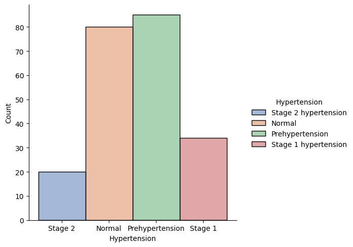

High Blood Pressure
Danh Dang
2025-02-28

# Introduction

High blood pressure (or hypertension) is a major health problem for older adults. As time passes, the body’s blood vessels change. The arteries get stiffer, causing blood pressure to go up. High blood pressure is also known as “the silent killer”, many may not even be aware they have it (National Institute on Aging, 2022). In the dataset below, hypertension was divided into four groups: “Prehypertension”, “Stage 1 hypertension”, “Stage 2 hypertension” and none-of-the-above. In this case study, patients are considered as high blood pressure group if they belong to stage 1 and stage 2 hypertension.

# About the dataset

This dataset was collected by Yongbo Liang et al. (2018). This dataset contains information of 219 patients in China, together with 13 variables. The dataset covers an age range of 20-89 years and records of diseases including hypertension and diabetes. The variables contained in this dataset are:

1. ID
2. Sex (Male / Female)
3. Age (Year)
4. Height (cm)
5. Weight (kg)
6. Systolic Blood Pressure (mmHg)
7. Diastolic Blood Pressure (mmHg)
8. Heart Rate (per minute)
9. BMI (kg/m^2)
10. Hypertension (Prehypertension, Stage 1, Stage 2, None)
11. Diabetes (Stage 1, Stage 2, None)
12. Cerebral Infarction
13. Cerebrovascular Disease

# Scenario and Goal of the case study

Scenario: Imagine yourself as an analyst of a pharmaceutical company that just developed a new medicine for patients with high blood pressure. The company now wants to know how to maximize the sales by advertising the new medication to those who are susceptible to it.

Goal: find the group of people that has higher risk of having high blood pressure.

# Analysis

## Transform the dataset

First, we load the necessary packages and dataset.


```python
import numpy as np
import pandas as pd
import matplotlib.pyplot as plt
from matplotlib.pyplot import subplots
import seaborn as sns
```


```python
data = pd.read_csv("dataset.csv")
```

Next, we replace NA values in the dataset with "Normal". The NA values in the dataset shows that observations do not have one of the conditions.


```python
data[["Diabetes", "cerebral infarction", "cerebrovascular disease"]] = data[["Diabetes", "cerebral infarction", "cerebrovascular disease"]].fillna("Normal")
```

We perform preliminary check on the dataset.


```python
data.dtypes
```


    Num.                                int64
    subject_ID                          int64
    Sex(M/F)                           object
    Age(year)                           int64
    Height(cm)                          int64
    Weight(kg)                          int64
    Systolic Blood Pressure(mmHg)       int64
    Diastolic Blood Pressure(mmHg)      int64
    Heart Rate(b/m)                     int64
    BMI(kg/m^2)                       float64
    Hypertension                       object
    Diabetes                           object
    cerebral infarction                object
    cerebrovascular disease            object
    dtype: object


```python
data.describe()
```


<div>
<style scoped>
    .dataframe tbody tr th:only-of-type {
        vertical-align: middle;
    }

    .dataframe tbody tr th {
        vertical-align: top;
    }

    .dataframe thead th {
        text-align: right;
    }
</style>
<table border="1" class="dataframe">
  <thead>
    <tr style="text-align: right;">
      <th></th>
      <th>Num.</th>
      <th>subject_ID</th>
      <th>Age(year)</th>
      <th>Height(cm)</th>
      <th>Weight(kg)</th>
      <th>Systolic Blood Pressure(mmHg)</th>
      <th>Diastolic Blood Pressure(mmHg)</th>
      <th>Heart Rate(b/m)</th>
      <th>BMI(kg/m^2)</th>
    </tr>
  </thead>
  <tbody>
    <tr>
      <th>count</th>
      <td>219.000000</td>
      <td>219.000000</td>
      <td>219.000000</td>
      <td>219.000000</td>
      <td>219.000000</td>
      <td>219.000000</td>
      <td>219.000000</td>
      <td>219.000000</td>
      <td>219.000000</td>
    </tr>
    <tr>
      <th>mean</th>
      <td>110.000000</td>
      <td>156.598174</td>
      <td>57.168950</td>
      <td>161.228311</td>
      <td>60.191781</td>
      <td>127.945205</td>
      <td>71.849315</td>
      <td>73.639269</td>
      <td>23.107215</td>
    </tr>
    <tr>
      <th>std</th>
      <td>63.364028</td>
      <td>101.604347</td>
      <td>15.874327</td>
      <td>8.202871</td>
      <td>11.886301</td>
      <td>20.377779</td>
      <td>11.111203</td>
      <td>10.738874</td>
      <td>4.004302</td>
    </tr>
    <tr>
      <th>min</th>
      <td>1.000000</td>
      <td>2.000000</td>
      <td>21.000000</td>
      <td>145.000000</td>
      <td>36.000000</td>
      <td>80.000000</td>
      <td>42.000000</td>
      <td>52.000000</td>
      <td>14.690000</td>
    </tr>
    <tr>
      <th>25%</th>
      <td>55.500000</td>
      <td>85.500000</td>
      <td>48.000000</td>
      <td>155.000000</td>
      <td>52.500000</td>
      <td>113.500000</td>
      <td>64.000000</td>
      <td>66.000000</td>
      <td>20.550000</td>
    </tr>
    <tr>
      <th>50%</th>
      <td>110.000000</td>
      <td>152.000000</td>
      <td>58.000000</td>
      <td>160.000000</td>
      <td>60.000000</td>
      <td>126.000000</td>
      <td>70.000000</td>
      <td>73.000000</td>
      <td>22.600000</td>
    </tr>
    <tr>
      <th>75%</th>
      <td>164.500000</td>
      <td>214.500000</td>
      <td>67.500000</td>
      <td>167.000000</td>
      <td>66.500000</td>
      <td>139.000000</td>
      <td>78.000000</td>
      <td>80.000000</td>
      <td>25.000000</td>
    </tr>
    <tr>
      <th>max</th>
      <td>219.000000</td>
      <td>419.000000</td>
      <td>86.000000</td>
      <td>196.000000</td>
      <td>103.000000</td>
      <td>182.000000</td>
      <td>107.000000</td>
      <td>106.000000</td>
      <td>37.460000</td>
    </tr>
  </tbody>
</table>
</div>


We exclude the Num. and subject_ID from the dataset, as we will not be using them during our analysis.


```python
data = data.drop(columns = ["Num.","subject_ID"], axis = 1)
```

We change the variables' names.


```python
data.columns = ["gender", "age", "height", "weight", "systolic", "diastolic", "heart_rate", "bmi", "hypertension", "diabetes",
                "cerebral_infarction", "cerebrovascular_disease"]
```

We create a new column called high_bp, observations with Stage 1 Hypertension or above are considered as having high blood pressure.


```python
data["high_bp"] = np.where((data["hypertension"] == "Normal") | (data["hypertension"] == "Prehypertension"), "Normal", "High")
```

Observations are classified based on their BMI values. BMI values of 24.9 or above means high BMI, and values lower than 18.5 are low BMI.


```python
data["bmi_c"] = np.where(data["bmi"] > 24.9, "High", 
                         np.where(data["bmi"] < 18.5, "Low", "Normal"))
```

## Data Exploratory Analysis

From the dataset we are using, there are some variables that stand out as possible factors on blood pressure. These variables are sex, age, heart rate, BMI, diabetes, cerebral infarction and cerebrovascular disease. We will begin with checking the correlation between age, heart rate and BMI.


```python
data[["age", "heart_rate", "bmi"]].corr()
```


<div>
<style scoped>
    .dataframe tbody tr th:only-of-type {
        vertical-align: middle;
    }

    .dataframe tbody tr th {
        vertical-align: top;
    }

    .dataframe thead th {
        text-align: right;
    }
</style>
<table border="1" class="dataframe">
  <thead>
    <tr style="text-align: right;">
      <th></th>
      <th>age</th>
      <th>heart_rate</th>
      <th>bmi</th>
    </tr>
  </thead>
  <tbody>
    <tr>
      <th>age</th>
      <td>1.000000</td>
      <td>-0.085640</td>
      <td>0.016326</td>
    </tr>
    <tr>
      <th>heart_rate</th>
      <td>-0.085640</td>
      <td>1.000000</td>
      <td>-0.105521</td>
    </tr>
    <tr>
      <th>bmi</th>
      <td>0.016326</td>
      <td>-0.105521</td>
      <td>1.000000</td>
    </tr>
  </tbody>
</table>
</div>


As we can see, there are almost no correlation between all three variables above, so we can use all of them in our analysis.

Now we will confirm the distribution of the blood pressure data.


```python
p = sns.displot(data = data, x = "gender", hue = "gender", palette = "deep")
p.set(xlabel= "Gender")
p.legend.set_title("Gender");
```


    

    


```python
p = sns.displot(data = data, x = "hypertension", hue = "hypertension", palette = "deep")
p.set(xlabel = "Hypertension")
p.set_xticklabels(["Stage 2", "Normal", "Prehypertension", "Stage 1"])
p.legend.set_title("Hypertension")
;
```


    ''


    

    


```python
g = sns.displot(data = data, x = "high_bp", hue = "high_bp", palette = "deep")
g.legend.set_title("Blood Pressure")
g.set_xlabels("Blood Pressure");

```


    

    


There are almost three times the data for patients with “Normal” blood pressure compared to those with “High” blood pressure. We will keep this result in mind as we further analyze the dataset.

## Analysis With Variables

### Gender


```python
p = sns.displot(data = data, x = "gender", hue = "high_bp", palette = "deep", multiple = "stack")
p.set(xlabel = "Gender")
p.legend.set_title("Blood Pressure")
;
```


    ''


    

    


It seems that we have similar number of male and female patients in our data, and it also appears that they have different proportion of people with high blood pressure. We shall dig deeper by defining a function to check the 95% confident interval.


```python
def ci95_high(data, dv, value):
    sub = data[dv == value]["high_bp"] == "High"
    m = np.mean(sub)
    se = np.std(sub)/np.sqrt(len(data))
    ci95 = [m - 1.96*se, m, m + 1.96*se]
    return [round(i, 2) for i in ci95]

```

This function will calculate the proportion of patients with “High” blood pressure within a certain group. The output is the 95% confident interval of said value.


```python
ci95_high(data = data, dv = data["gender"], value = "Female")
```


    [0.18, 0.23, 0.29]


```python
ci95_high(data = data, dv = data["gender"], value = "Male")
```


    [0.2, 0.26, 0.32]


There is an overlap between two interval. This means that the difference between the two genders is not statistical significant at 95%, so we cannot claim that gender can affect blood pressure.

### Age


```python
g = sns.FacetGrid(data = data, col = "high_bp", hue = "high_bp", palette = "deep")
g.map_dataframe(sns.histplot, x = "age", binwidth = 5, binrange = (20,90))
g.set_titles("{col_name} Blood Pressure")
g.set_axis_labels("Age");
```


    

    


There is a pattern here, it seems that only those higher than 45 years of age have high blood pressure. This is an important result that will help us reach our goal.

### BMI

To simplify the analysis, here we we will use the BMI categories.


```python
gb = data.groupby(["bmi_c", "high_bp"]).agg({"gender":"count"}).groupby(level = 0).apply(lambda x: round(100*x/x.sum(),2))
gb = gb.droplevel(0).reset_index()
p = sns.barplot(gb[gb["high_bp"] == "High"], x = "bmi_c", y = "gender")
p.set(xlabel = "BMI", ylabel = "Percentage (%)", title = "High Blood Pressure per BMI Group");
```


    

    


The results of this plot show that people with high BMI value have a significantly higher chance of getting high blood pressure (43%) than those with lower BMI value.

### Heart rate

Higher heart rate means the heart has to pump blood more frequently. We shall see if it will also result in higher blood pressure. We will check the correlation between heart rate and blood pressure values.


```python
p = sns.scatterplot(data = data, x = "heart_rate", y = "diastolic")
p.set(xlabel = "Heart Rate (per minute)", ylabel = "Diastolic Pressure (mmHg)");
```


    

    


```python
p = sns.scatterplot(data = data, x = "heart_rate", y = "systolic")
p.set(xlabel = "Heart Rate (per minute)", ylabel = "Systolicc Pressure (mmHg)");
```


    

    


The output indicates that there are no correlation between heart rate and blood pressure values. Higher heart rate does not lead to higher blood pressure values.

### Diabetes

Several research papers have pointed out that diabetes leads to higher blood pressure. We shall see if the result holds true in this group of patients.


```python
gb = data.groupby(["diabetes", "high_bp"]).agg({"gender":"count"}).groupby(level = 0).apply(lambda x: round(100*x/x.sum(), 2))
gb = gb.droplevel(0).reset_index()
gb.columns = ["Diabetes Type", "Blood Pressure", "Percentage"]
gb[gb["Blood Pressure"] == "High"]
```


<div>
<style scoped>
    .dataframe tbody tr th:only-of-type {
        vertical-align: middle;
    }

    .dataframe tbody tr th {
        vertical-align: top;
    }

    .dataframe thead th {
        text-align: right;
    }
</style>
<table border="1" class="dataframe">
  <thead>
    <tr style="text-align: right;">
      <th></th>
      <th>Diabetes Type</th>
      <th>Blood Pressure</th>
      <th>Percentage</th>
    </tr>
  </thead>
  <tbody>
    <tr>
      <th>0</th>
      <td>Diabetes</td>
      <td>High</td>
      <td>100.00</td>
    </tr>
    <tr>
      <th>1</th>
      <td>Normal</td>
      <td>High</td>
      <td>24.86</td>
    </tr>
    <tr>
      <th>3</th>
      <td>Type 2 Diabetes</td>
      <td>High</td>
      <td>21.62</td>
    </tr>
  </tbody>
</table>
</div>


The results above show that patients with diabetes do not have higher blood pressure than those without. Note that in this dataset, only one person has Diabetes (type 1), that is why the percentage is 100%. We can check the fact by using the following code.


```python
pd.DataFrame(data["diabetes"].value_counts())
```


<div>
<style scoped>
    .dataframe tbody tr th:only-of-type {
        vertical-align: middle;
    }

    .dataframe tbody tr th {
        vertical-align: top;
    }

    .dataframe thead th {
        text-align: right;
    }
</style>
<table border="1" class="dataframe">
  <thead>
    <tr style="text-align: right;">
      <th></th>
      <th>count</th>
    </tr>
    <tr>
      <th>diabetes</th>
      <th></th>
    </tr>
  </thead>
  <tbody>
    <tr>
      <th>Normal</th>
      <td>181</td>
    </tr>
    <tr>
      <th>Type 2 Diabetes</th>
      <td>37</td>
    </tr>
    <tr>
      <th>Diabetes</th>
      <td>1</td>
    </tr>
  </tbody>
</table>
</div>


### Diseases

Lastly, we want to know whether cerebral infarction and cerebrovascular disease have an effect on blood pressure. Both of these terms describe the state of blood insufficiency to the brain.


```python
gb = data.groupby(["cerebral_infarction", "high_bp"]).agg({"gender":"count"}).groupby(level = 0).apply(lambda x: round(100*x/x.sum(),2)).droplevel(0).reset_index()
gb.columns = ["Cerebral Infarction", "Blood Pressure", "Percentage"]
gb.pivot(index = ["Cerebral Infarction"], columns = "Blood Pressure")
```


<div>
<style scoped>
    .dataframe tbody tr th:only-of-type {
        vertical-align: middle;
    }

    .dataframe tbody tr th {
        vertical-align: top;
    }

    .dataframe thead tr th {
        text-align: left;
    }

    .dataframe thead tr:last-of-type th {
        text-align: right;
    }
</style>
<table border="1" class="dataframe">
  <thead>
    <tr>
      <th></th>
      <th colspan="2" halign="left">Percentage</th>
    </tr>
    <tr>
      <th>Blood Pressure</th>
      <th>High</th>
      <th>Normal</th>
    </tr>
    <tr>
      <th>Cerebral Infarction</th>
      <th></th>
      <th></th>
    </tr>
  </thead>
  <tbody>
    <tr>
      <th>Normal</th>
      <td>22.61</td>
      <td>77.39</td>
    </tr>
    <tr>
      <th>cerebral infarction</th>
      <td>45.00</td>
      <td>55.00</td>
    </tr>
  </tbody>
</table>
</div>


```python
gb = data.groupby(["cerebrovascular_disease", "high_bp"]).agg({"gender":"count"}).groupby(level = 0).apply(lambda x: round(100*x/x.sum(),2)).droplevel(0).reset_index()
gb.columns = ["Cerebrovascular Disease", "Blood Pressure", "Percentage"]
gb.pivot(index = ["Cerebrovascular Disease"], columns = "Blood Pressure")
```


<div>
<style scoped>
    .dataframe tbody tr th:only-of-type {
        vertical-align: middle;
    }

    .dataframe tbody tr th {
        vertical-align: top;
    }

    .dataframe thead tr th {
        text-align: left;
    }

    .dataframe thead tr:last-of-type th {
        text-align: right;
    }
</style>
<table border="1" class="dataframe">
  <thead>
    <tr>
      <th></th>
      <th colspan="2" halign="left">Percentage</th>
    </tr>
    <tr>
      <th>Blood Pressure</th>
      <th>High</th>
      <th>Normal</th>
    </tr>
    <tr>
      <th>Cerebrovascular Disease</th>
      <th></th>
      <th></th>
    </tr>
  </thead>
  <tbody>
    <tr>
      <th>Normal</th>
      <td>24.74</td>
      <td>75.26</td>
    </tr>
    <tr>
      <th>cerebrovascular disease</th>
      <td>50.00</td>
      <td>50.00</td>
    </tr>
    <tr>
      <th>insufficiency of cerebral blood supply</th>
      <td>6.67</td>
      <td>93.33</td>
    </tr>
  </tbody>
</table>
</div>


The results above indicates that patients with cerebral infarction and cerebrovascular disease also have a higher chance of high blood pressure (45% and 50%, respectively) compared to those without. Note that the number of total observations are low in both cases.

### Conclusion

From the results above, in order to improve sales, we should focus our campaign on patients above 45 years old, those with high BMI, and patients with either cerebral infarction or cerebrovascular disease.

## Age 45

The results above have shown that most patients with high blood pressure are older than 45 years old. In this part, we will try to improve our prediction further by only including those older than 45 in our new dataset.


```python
data45 = data[data["age"] >= 45]
```

### BMI

Instead of using BMI categories, we will use BMI values.


```python
p = sns.histplot(data = data45, x = "bmi", bins = 5, hue = "high_bp", multiple = "stack")
p.set(xlabel = "BMI");
```


    

    


It appears that there is a spike in the proportion of those with high blood pressure when BMI is higher than 30. We will confirm the results above.


```python
pd.DataFrame([100*round(np.mean(data45[data45["bmi"] >= 30]["high_bp"] == "High"),3),
              100*round(np.mean(data45[data45["bmi"] < 30]["high_bp"] == "High"),3)], index = ["30 or above", "Below 30"], columns = ["Percentage"])

```


<div>
<style scoped>
    .dataframe tbody tr th:only-of-type {
        vertical-align: middle;
    }

    .dataframe tbody tr th {
        vertical-align: top;
    }

    .dataframe thead th {
        text-align: right;
    }
</style>
<table border="1" class="dataframe">
  <thead>
    <tr style="text-align: right;">
      <th></th>
      <th>Percentage</th>
    </tr>
  </thead>
  <tbody>
    <tr>
      <th>30 or above</th>
      <td>63.6</td>
    </tr>
    <tr>
      <th>Below 30</th>
      <td>27.2</td>
    </tr>
  </tbody>
</table>
</div>


We can see that there is a significant difference between them (64% and 27%).

Similar analysis were performed using other variables (heart rate, diabetes and other diseases), however, none of them show significant difference than the analysis using the whole dataset.

# Conclusion

What did we learn after analyzing the dataset?

1. Individuals of the age above 45, or those with high BMI, affected by cerebral infarction or cerebrovascular disease have higher chance of getting hypertension.
2. Aged adults with the BMI value of 30 or above have significantly higher rate of hypertension than those with lower BMI values.

# Future Plan

So what should we do as an analyst to improve sales?

1. The advertising campaign should focus on the population that satisfies that conditions above.
2. Based on the targeted population, we can also derive better advertising strategy. For example, the type of media that people of the age 45 or above use might be different than those who are younger.
